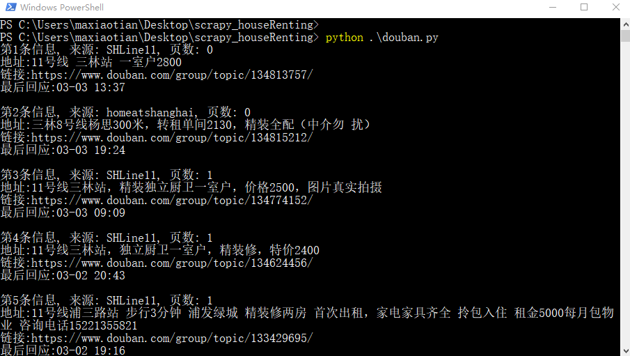

# scrapy_houseRenting
这是一个简单的面向豆瓣爬虫获取租房信息的程序

## 使用方法：
- 登入网页豆瓣后，F12将cookie保存下来，填入程序中
- 选择自己需要爬虫的小组，填入代码url中
- 将筛选关键字写入代码中的keywords
- 设置过期时间

```python
    python douban.py
```

所爬程序将在终端中显示目标链接，并存入相应的douban.txt

## 结果：
<div align="center">
	
</div>